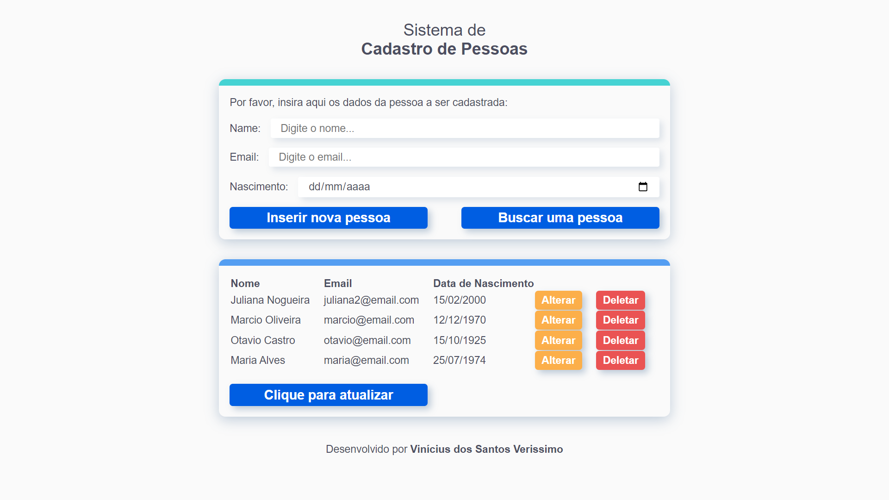
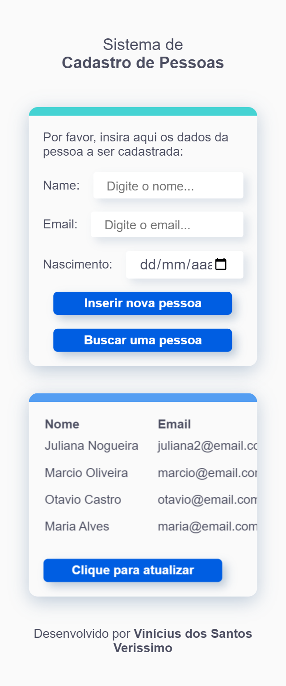

# Simbiose Front-End

### Screenshot

### Screenshot - Mobile Version

  

### Construído com

-   React
-   Vite
-   JavaScript
-   TypeScript
-   Axios
-   Styled-Components
-   React Hook Form
-   Yup
-   Sweet Alert

A aplicação foi construída utilizando ReactJS com Typescript, por meio do Vite, com a
utilização do framework Styled-Components para estilização.

Utilizei a biblioteca React Hook Form em conjunto com a Yup a fim de facilitar o controle
das informações a serem preenchidas pelo usuário nos inputs do formulário e exibir
mensagens de erro para cada input.

Ao clicar no botão "Inserir nova pessoa", caso os inputs estejam devidamente preenchidos e
o e-mail inserido já não esteja cadastrado, a tabela no campo inferior é atualizada com os
dados da pessoa recém-cadastrada.

É possível fazer a busca por uma pessoa específica por meio do botão "Buscar uma pessoa",
que ao ser clicado exibe um modal com um input do email a ser procurado. O usuário buscará
a pessoa pelo email, mas a requisição será enviada à API com o ID da pessoa, caso o email
exista entre a listagem de pessoas cadastradas e exibidas na tabela.

Caso não exista, é exibida uma mensagem de que não foi localizada nenhuma pessoa pelo
email informado.

Abaixo, há a tabela com a exibição de todas as pessoas cadastradas, sendo que as duas
últimas colunas possuem os botões de alterar e deletar uma pessoa.

Ao clicar no botão "Alterar", é aberto um modal com inputs a serem preenchidos com as
novas informações da pessoa, e ao clicar em "Confirmar alteração" é enviada uma requisição
via método HTTP PUT à API. Caso o novo email informado já esteja em uso por outra pessoa
cadastrada, é retornado um erro e exibida essa informação ao usuário.

Ao clicar no botão "Deletar", é aberto um modal pedindo uma confirmação ao usuário antes
de prosseguir à exclusão.

Caso o usuário confirme a deleção, é enviada uma requisição via método HTTP DELETE à API,
e caso a operação seja efetuada, é exibida uma mensagem de "Pessoa excluída com sucesso do
banco de dados", sendo a tabela atualizada logo em seguida.

### Como utilizar

Para tanto, será preciso clonar o repositório e executar o comando 'npm install' no
terminal para instalar as dependências necessárias.

Após isso, é preciso executar 'npm run dev' no terminal para iniciar a aplicação,
consumindo a API construída com Java e Spring Boot cujo deploy foi feito em cloud.

## Autor

-   GitHub - Vinícius dos Santos Verissimo (https://github.com/viniciusdsv93)
